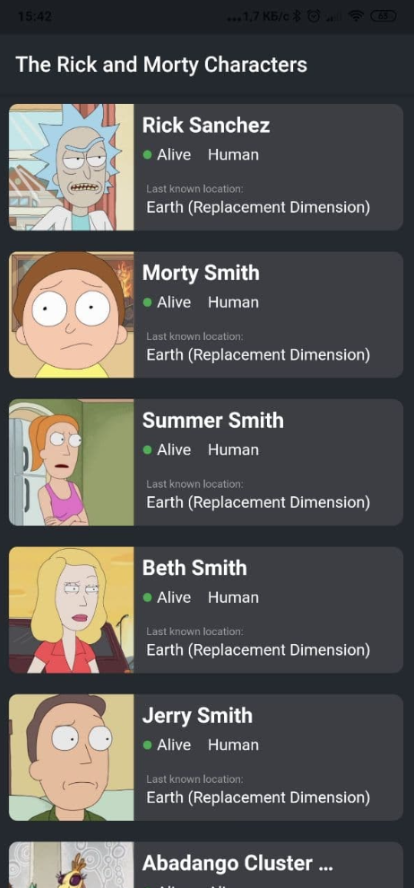
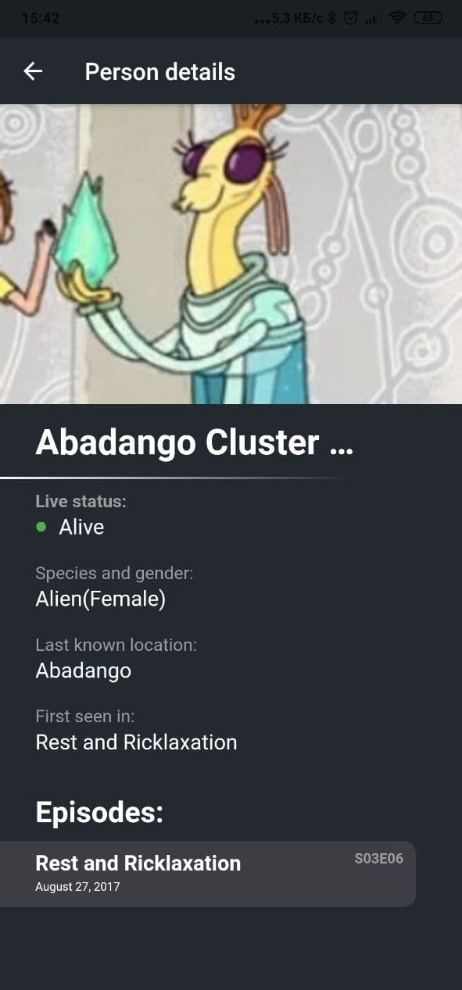

## Тестовое задание от Digital Oxygen по Flutter

### Основное задание
Создать приложение-клиент, которое отображает список персонажей вселенной Рик и Морти. Данные брать по REST API с данного ресурса: https://rickandmortyapi.com/. Создать динамически подгружаемый список персонажей, по клику на каждый элемент – загружается карточка персонажа.

### Дополнительное задание
Использовать данные для создания списков серий, локаций и т.п.

### Пример оформления

  
  

### APK выполненного задания
https://drive.google.com/file/d/1NXtxjlm6I6teAR4AUEsX7v5ZKpSKx2NL/view?usp=sharing
